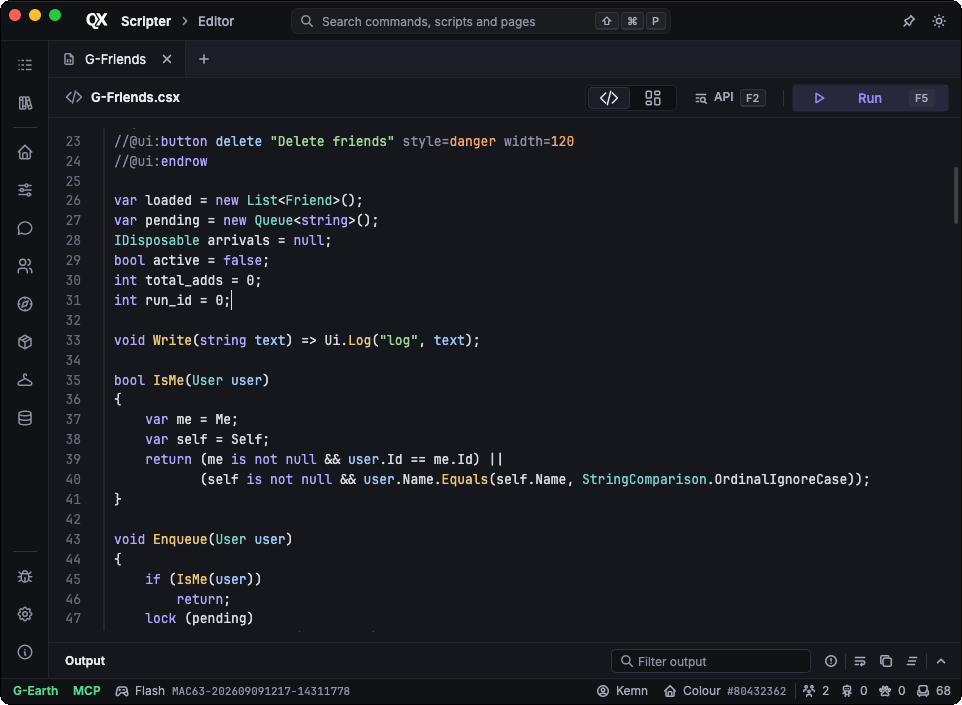

# QX Scripter

QX Scripter is a C# scripting extension for G-Earth for Flash.

### Currently in **alpha**. Expect bugs and changes to the script API. Bug reports and pull requests are welcome.




## Community scripts

Find and share scripts at [qxscripter.xyz](https://qxscripter.xyz/)

## MCP

QX exposes game data, scripting and the desktop editor through MCP (Streamable HTTP). Copy the connection URL from Settings into your client. Default endpoint: `http://127.0.0.1:9390/mcp`.

Compile a script without running it:

```json
{
  "jsonrpc": "2.0",
  "id": 1,
  "method": "tools/call",
  "params": {
    "name": "compile_check",
    "arguments": { "code": "Log(RoomId);" }
  }
}
```

`get_connection` checks the session, `list_api` lists script methods, `run_code` runs a script.

## Building from source

Requires the .NET SDK version in [global.json](global.json).

```powershell
git clone https://github.com/QDaves/QX-Scripter.git
cd QX-Scripter
dotnet restore QX.slnx --locked-mode
dotnet build QX.slnx -c Release --no-restore
```

Desktop:

```powershell
dotnet run --project src/QX.Desktop -c Release --no-build
```

CLI:

```powershell
dotnet run --project src/QX.App -c Release --no-build -- -p 9092 -q
```

Package (PowerShell 7), output in `artifacts/`:

```powershell
./tools/publish.ps1 -runtime win-x64 -edition Desktop
./tools/publish.ps1 -runtime osx-arm64 -edition CLI
```

### macOS

The desktop package contains `QX Scripter.app`. Move it to `/Applications`. The bundle is unsigned; run once:

```bash
xattr -cr "/Applications/QX Scripter.app"
codesign --force --deep --sign - "/Applications/QX Scripter.app"
```

Create `~/qx-scripter.sh`:

```bash
#!/bin/sh
exec "/Applications/QX Scripter.app/Contents/MacOS/QX" "$@"
```

`chmod +x ~/qx-scripter.sh`, then install it from the G-Earth extensions tab.

## CLI

The CLI runs scripts, game operations and MCP without the desktop window. No editor, no script panels. MCP uses the same `mcp.json` as the desktop edition.

```powershell
.\QX.exe -p 9092 -q --script .\my-script.csx
```

`QX.exe app help` lists the application commands.

---

Requires the [.NET 10 Runtime](https://dotnet.microsoft.com/en-us/download/dotnet/10.0); the Desktop Runtime works too.

Created by [QDave](https://github.com/QDaves). Thanks to [b7](https://github.com/b7c) and his work on xabbo.
